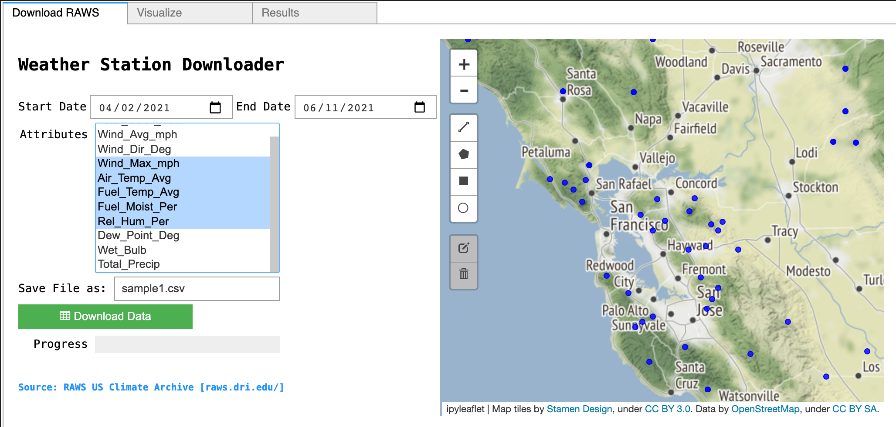
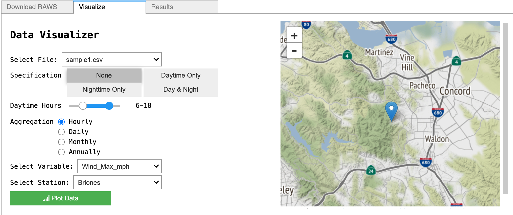
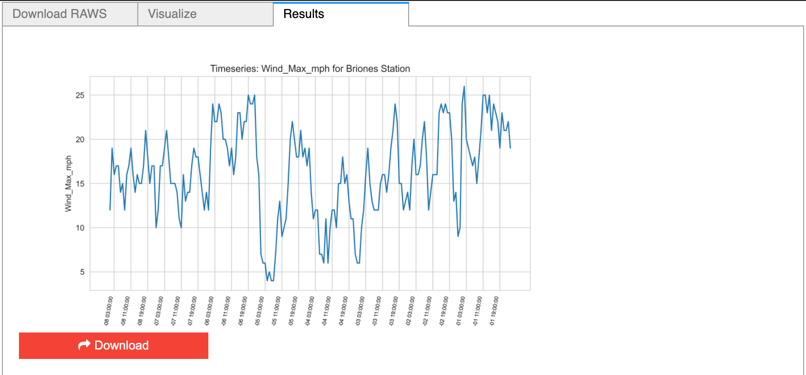

# Interactive Applications via ipywidget for Downloading Historical Meteorological Data from RAWS</u>

## Table of Contents  
- [Project Details](#project-details)  
- [Setup](#setup)  
- [Primary Packages & Tools](#primary-packages-&-tools) 
- [Data Sources](#data-sources)   
- [Walk-Through](#walk-through)  
    1. [Interactive Mapping & Selection](#(1)-interactive-mapping-&-selection)  
    2. [Additional Specification](#(2)-additional-specification)  
    3. [Visualizing Weather Data](#(3)-visualizing-weather-data)   
___

## Project Details

The main objective of this exercise is to create an alternative way to bulk data download and visualize weather station datasets from RAWS for a more pleasant user experience. The application will allow users to download hourly weather station data and visualize a timeseries plot based on certain user specified parameters (daytime/nightime, daily aggregation, etc.) within an iPython notebook environment. This immersive experience is made possible by an array of packages, mainly ipyleaflet and ipywidget. 

## Primary Packages & Tools

- ipyleaflet 
- ipywidget
- requests, urllib3, re, beautifulsoup, json
- numpy, panda, geopandas, shapely
- jupyter notebook (ipynb) for displaying custom GUI

## Data Sources

Remote Automatic Weather Stations (RAWS): 
- https://raws.dri.edu/

## Walk-Through

## (1) Interactive Mapping & Selection

The initial tab allows for the user to specify a region on the ipyleaflet map using the Draw Control widgets to select weather stations in the AOI. The user can also select a start/end date range, weather variables, and specify the filename. 

  

## (2) Additional Specification

The Data Visualizer tab lets users select a specific file from the previous step. Since each search instance saves a csv file, multiple searches can be conducted and later pulled to be read into the subsequent data processing steps. 

The specification options i.e. None, Daytime Only, Nighttime Only, Day & Night allows users to distinguish the data based on daytime and nightime. Time range defined to be 'day' vs 'night' can also be modified with the number slider. For example, daytime hours can be specified as 6 am to 6pm, where all times outside of this range are defined as nightime hours. 

Data can also be aggregated as hourly, daily, monthly, and annually. Finally, the user can specify the variable and station name to be plotted. Once the station is selected, the map will auto refresh to display the location of the selected station. 

  

## (3) Visualizing Weather Data

The final tab displays the output of the timeseries plot. The download button allows user to download the plot as a image file to be saved in the specified directory. 

